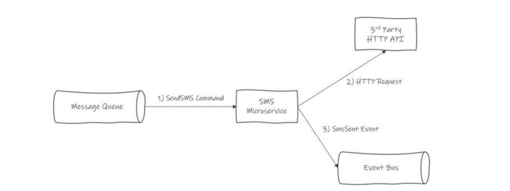

# Backend Engineering - Technical Exercise

### Introduction

At M-KOPA we try our best to hire great engineers who can work together deliver great software to high standards, and continually learn from + help each other in the pursuit of improving our craft; as part of that goal, we think that it’s important to see a real code example from every person who we bring onto our team. That said, we also want to see how you actually code, so rather than asking you to live-code on a screenshare or tackle a whiteboard exercise, we prefer to do a take-home exercise that lets you put your headphones on, sit at your normal desk, and show us how you work when you’re not distracted by the pressure of a live interview.

### This exercise is designed to take you a maximum of 3-4 hours to complete.

To keep the time commitment under control, please bear the following instructions in mind:

▪ If you find any aspect of the instructions to be too ambiguous for you to understand how to
approach the problem, please feel free to eliminate that ambiguity by making a simplifying
assumption and stating that assumption clearly in your readme

▪ If there are edge cases or other concerns that you are aware of but that you don’t have time to
handle fully in your implementation that is completely fine - please take note of these for
discussion during your follow-up interview (you can also include a discussion of them in your
readme, but don’t feel obliged) 

Finally remember that you will be talking through this exercise with us during your technical interview; therefore, what you need to produce is something that showcases your approach to software development and that provides a basis for further discussion. Your submission it should represent your skills well, but it doesn’t have to be perfect!

### The Exercise

M-KOPA primarily builds software using async event-based and message-based communication.The goal of this assignment is to allow you to showcase your comfort with the basics of async patterns, while also showing off your broader approach to building software systems.

Most M-KOPA customers do not have smart phones; therefore M-KOPA’s primary means of
communication with customers is via SMS (i.e., “text message”), which are received by customers on olderstyle feature phones. To send these SMS messages M-KOPA integrates withdifferent SMS service providers in each country where we operate.

The goal of this exercise is to build a simple microservice as a wrapper around the API for a 3rd. party SMS service. Assume that the 3rd. party SMS service receives some type of HTTP request inorder to send an SMS message to a customer’s phone number (implementations vary, but most providers use JSON POST requests with the target phone number and SMS message text in the body). Your microservice will abstract this HTTP interaction behind an async flow.

When a client wants to send an SMS to this 3rd. party service, the client will send a SendSms command into a message queue.1 Your microservice will then receive that command, make an HTTP request to the 3rd party client and, assuming that HTTP request is successful, publish an “SmsSent” event to a global event bus. The overall logical architecture therefore looks something like this:

In addition to the components drawn in the above diagram, you can assume that the SMS Microservice will have some kind of logger; you may also add any other components that you require in order to achieve the goals of this exercise.

By default, the SendSms command is expected to contain at least two parameters:

- PhoneNumber: The phone number that the SMS message is being sent to.
- SmsText: The actual text of the SMS message.

You may add additional parameters to the SendSms command as needed, and you may assumethat the SMS Microservice’s clients will be able to provide them; you may also assume that the body of the HTTP request to the 3rd party API has a similar structure to the SendSms command (e.g., a PhoneNumber and an SmsText parameter).

The goal of this exercise is to write the application logic for the SMS Microservice. You should assume that the specific technologies for the message queue, event bus, logger, and any other components that you choose to add have not been chosen and will not be chosen in the scope of this exercise. Therefore, you should program against abstractions only, with the assumption that someone else on your team will be taking over later, programming concrete implementations for each abstraction, and wiring everything together via dependency injection. Similarly, assume that the exact contract for the 3rd. party SMS API is not yet known, and that a concrete client will have to be written by someone else later.

(1. Assume that this is a well-known queue that both the sender and your microservice know how to find, connect to, and authenticate with.)

Finally, in building the application logic you should be aware of the following requirements:

▪ SMS messages often contain critical information (e.g., confirmation to a customer that they have
made a payment to M-KOPA); therefore, we need to do everything that we can to make sure
that SMS messages are reliably sent to customers.
▪ Receiving an SMS message twice is annoying for a customer but is tolerable if it is a very rare
occurrence; if exactly once semantics aren’t possible then occasionally failing by sending an SMS
message twice is acceptable.

### Your submission

Please submit a compressed file containing your source code and readme; the readme should contain instructions on how to build + run the application and its tests. Feel free to also include any additional information in the readme file that you think is relevant, although remembering that you will also have a chance to explain your approach verbally in a follow-up interview

### Please make sure to include:

- [ ]  A README file that is easy to read
- an explanation of what the problem is you are trying to solve
- thought process around which patterns you used
- included assumptions and tradeoffs
- included what you would do if you could have the time
- [ ]  Tests that add value and are easy to read
- [ ]  The submission is written in C#.NET 
